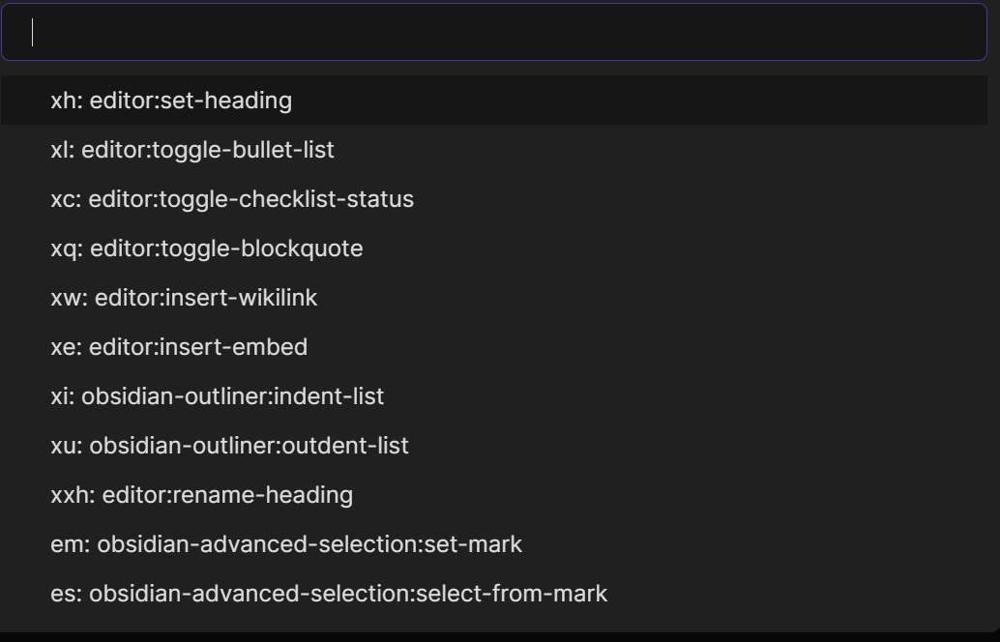

# Key Sequence Shortcut

Key Sequence Shortcut is an obsidian plugin, allow binding key sequences to an obsidian command. For example
- If we assume "t" stands for "toggle", we can bind "tl" to "Toggle Preview", "tb" to "Toggle Sidebar".  
- If we assume "x" stands for "text", we can bind "xl" to "Toggle Bulllet List", "xc" to "Toggle Check list status"

A key sequence is easier to memorize than typical key shortcut like "Ctrl-j".

# Install

Install by search "Key Sequence Shortcut" in Obsidian "Commnuity plugins" option.

# Usage

- Command "Open Key Sequence Menu" (bind to `Ctrl-m`). Type "xl" will execute `editor:toggle-bullet-list`, no need to type "Enter".

- Configuration
  - The default configuration file is "kssrc.md" at workspace root folder. Can be customized.
  - Double quote to start a comment line
  - key sequence and command id are splitted by a single tab character
  - Easy to find command id by command "Insert Command Id and Name" (bind to `Ctrl-*`)
  - `Key Sequence Shortcut` will run corresponding command as long at user input matches any configuration item, so "xh" will hide key sequences like "xha", "xhb". Please avoid to have one key sequence to be the prefix of other key sequences.
- Run command "Reload Key Sequence Shortcut Config File" to reload after configuration file change

# Configuration example

```
" p for project
pf	darlal-switcher-plus:switcher-plus:open	"Quick Switcher++: Open"

" x for text
xh	editor:set-heading
xl	editor:toggle-bullet-list
xc	editor:toggle-checklist-status
xq	editor:toggle-blockquote
xw	editor:insert-wikilink
xe	editor:insert-embed
xi	editor:indent-list
xu	editor:unindent-list

" xx for refactor
xxh	editor:rename-heading

" e for editor
em	obsidian-mark-and-select:set-mark
es	obsidian-mark-and-select:select-from-mark
"	following two commands only available on mobile
er	editor:redo
eu	editor:undo
```

# Acknowledgement

This plugin is inspired by Vim multi-key shortcut and VSpaceCode. Text editing will never been so much fun without such key sequence shortcut.

In the Obsidian world, I love vimrc-support plugin so much and I am using it literally everyday. It already support key sequence shortcut in editor VIM mode. Then why do I create `Key Sequence Shortcut` plugin? Because many situations there are no VIM mode, below are some pain points:
- Users who don't like VIM mode
- On Obsidian Mobile (I have too many buttons in Mobile toolbar!)
- On desktop
  - When I switch to Markdown preview mode, I lose the VIM editor mode and can't switch back with key sequence.

